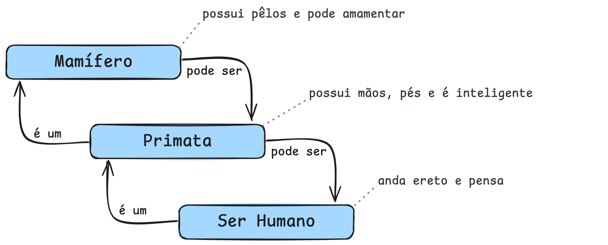
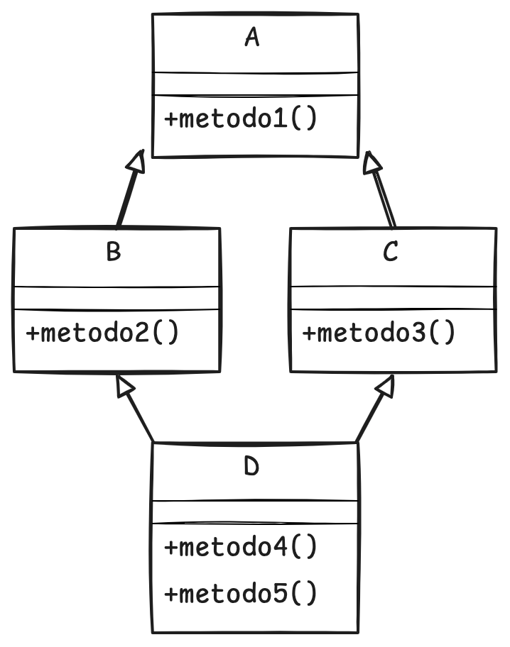

# Princípio da Herança

Este arquivo aborda o conceito de **herança**, explicando sua analogia com a biologia e destacando sua importância para
a reutilização de código e especialização de classes.

São apresentados exemplos práticos, a diferença entre superclasse e subclasse, além das distinções entre herança simples
e múltipla, incluindo o problema do diamante.

O texto enfatiza como a herança contribui para a integridade, consistência e manutenção dos sistemas orientados a
objetos.

    <em>O resumo acima foi gerado por IA.</em>

---

## Índice

- [Princípio da Herança](#princípio-da-herança)
  - [Índice](#índice)
  - [O que é?](#o-que-é)
  - [Superclasse e subclasse](#superclasse-e-subclasse)
  - [Herança simples e herança múltipla](#herança-simples-e-herança-múltipla)
  - [Qual a sua importância?](#qual-a-sua-importância)
  - [Exemplos](#exemplos)
    - [Exemplo em Python](#exemplo-em-python)
    - [Exemplo em PHP](#exemplo-em-php)

---

## O que é?

Na biologia, um filho (Y) **herda** as características genéticas dos pais (X) e, posteriormente, repassa as suas
características (Y) e as dos seus pais (X) para seu filho (Z).

Dentro da POO, esse princípio funciona da mesma forma, permitindo **expandir** e **especializar** (ou evoluir)
determinada característica ou comportamento.

> Faz-se uso da semântica "é um" para determinar a cardinalidade de herança.

- O Mamífero possui pêlos e pode amamentar.
- O Primata, que **é um** Mamífero, possui mãos e pés, além de ser inteligente.
- O Ser Humano, que **é um** Primata, consegue andar ereto e pensar.

Portanto:

> O Ser Humano **é um** Primata, bem como **é um** Mamífero.
>
> Ele possui pêlos, mãos e pés, amamenta, é inteligente, anda ereto e pensa.

No contexto semântico, a preposição inversa também ocorre, porém por meio da expressão "pode ser".

> Considerando a semântica anterior, pode-se dizer que o inverso ocorre por meio da expressão a seguir:
>
> Um Mamífero **pode ser** um Ser Humano.

    

---

Herança, na prática, significa a possibilidade de construir objetos especializados que herdam as características de
objetos mais generalistas (olha a generalização aparecendo aqui novamente, vide [aula 01](01-fundamentos.md)).

Trata-se de um mecanismo fundamental de **reutilização de código**, permitindo que novas classes mais específicas
aproveitem os atributos e métodos de classes já existentes, herdando assim os recursos da classe hierarquicamente
superior e adicionando suas próprias particularidades.

Quanto aos sistemas reais, podemos trazer sobre os sistemas de área da saúde, como a hierarquia dos agentes envolvidos:

- Pessoas
  - Empregados
    - Médicos
    - Enfermeiros
  - Terceirizados
    - Biomédicos
  - Pacientes
    - Paciente particular
    - Paciente conveniado
    - Paciente público (SUS)

Observe como a estrutura formada se assemelha a uma árvore. A sua raiz, portanto, é o que dá origem a todos os demais
agentes envolvidos em um sistema de saúde. Com isso, duas afirmações podem ser feitas:

1. Cada agente herda as características dos seus antecessores.
2. "Pessoas" é uma classe hierarquicamente superior e que dela são herdadas características para a formação de novas
   classes, como Empregados e Pacientes.

---

## Superclasse e subclasse

Partindo da premissa de que tudo é objeto e considerando a hierarquia vista acima, podemos afirmar que Pessoa é uma
superclasse e que Empregados é uma subclasse de Pessoa.

A herança normalmente resulta em subclasses mais especializadas e específicas do que suas respectivas superclasses.

É importante observar que o prefixo "sub" no termo "subclasse" pode gerar um equívoco, sugerindo erroneamente que ela
possua menos recursos que a superclasse.

Na realidade, ocorre exatamente o oposto: uma subclasse herda todos os atributos e métodos da superclasse e ainda pode
adicionar suas próprias características particulares, tornando-se assim mais completa e especializada do que a classe da
qual deriva.

> 🚨 **Importante!** Se você não entendeu a questão semântica, volte lá e leia até entender.

## Herança simples e herança múltipla

Diferente de algumas leis da natureza, onde a herança ocorre quando um objeto herda características de uma superclasse
(**herança simples**), a **herança múltipla** possibilita a um objeto herdar as características de mais uma superclasse.

A **herança múltipla** é um tema controverso, pois pode gerar situações intrincadas e, por vezes, confusas. O ponto
central da discussão reside no fato de que as **subclasses** são naturalmente mais especializadas que suas respectivas
**superclasses**. Assim, herdar características muito específicas de múltiplas classes pode resultar em maior
complexidade do que benefícios práticos.

Embora a herança ofereça um poder considerável na programação orientada a objetos, é importante lembrar que outras
abordagens, como **agregação** e **composição**, também são ferramentas poderosas e podem ser mais adequadas em
determinados contextos.

Um dos problemas clássicos de **ambiguidade e complexidade** associados à herança múltipla é o **problema do diamante**:

    

As classes B e C herdam de A, ou seja, são mais especializadas. Destas duas subclasses é gerada uma nova classe, D, que
herda de B e C. Estranho, mas é possível.

> **Pergunta-se:** se chamamos um método em D, conhecido em A por herança, de onde virá esta herança, de A ou de B?

## Qual a sua importância?

O princípio da Herança garante **reuso de código** e **maior integridade e consistência** das funcionalidades
implementadas.

Quando o comportamento de um método é alterado, todas as classes que a herdam terão seu comportamento igualmente
alterado.

## Exemplos

### Exemplo em Python

[Ver código completo aqui](assets/03/code/exemplo-py.md).

### Exemplo em PHP

[Ver código completo aqui](assets/03/code/exemplo-php.md).
