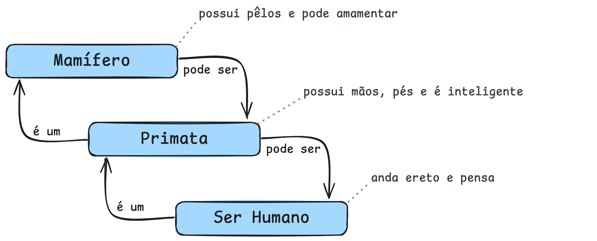
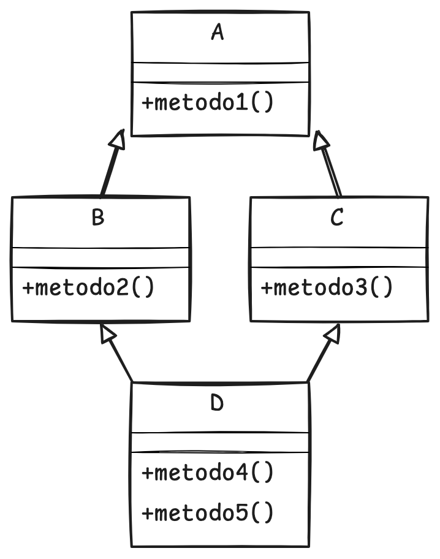

# Princípio da Herança

Este arquivo aborda o conceito de **herança**, explicando sua analogia com a biologia e destacando sua importância para
a reutilização de código e especialização de classes.

São apresentados exemplos práticos, a diferença entre superclasse e subclasse, além das distinções entre herança simples
e múltipla, incluindo o problema do diamante.

O texto enfatiza como a herança contribui para a integridade, consistência e manutenção dos sistemas orientados a
objetos.

    <em>O resumo acima foi gerado por IA.</em>

---

## Índice

[⬅️ Voltar à página principal](../README.md)

- [Princípio da Herança](#princípio-da-herança)
  - [Índice](#índice)
  - [O que é?](#o-que-é)
  - [Superclasse e subclasse](#superclasse-e-subclasse)
  - [Herança simples e herança múltipla](#herança-simples-e-herança-múltipla)
  - [Qual a sua importância?](#qual-a-sua-importância)
  - [Exemplos](#exemplos)
    - [Exemplo em Python](#exemplo-em-python)
    - [Exemplo em PHP](#exemplo-em-php)
  - [Exercício](#exercício)
    - [Resolução do exercício](#resolução-do-exercício)
    - [Passo 1: interpretação e identificação](#passo-1-interpretação-e-identificação)
    - [Passo 2: resolução do primeiro requisito](#passo-2-resolução-do-primeiro-requisito)
    - [Passo 3: resolução do segundo requisito](#passo-3-resolução-do-segundo-requisito)
      - [Em Python](#em-python)
      - [Em PHP](#em-php)
    - [Passo 4: resolução do terceiro requisito](#passo-4-resolução-do-terceiro-requisito)
      - [Em Python](#em-python-1)
      - [Em PHP](#em-php-1)
    - [Passo 5: resolução do quarto requisito](#passo-5-resolução-do-quarto-requisito)
      - [Em Python](#em-python-2)
      - [Em PHP](#em-php-2)
    - [Passo 6: resolução do quinta (e último) requisito](#passo-6-resolução-do-quinta-e-último-requisito)
      - [Em Python](#em-python-3)
      - [Em PHP](#em-php-3)
  - [Mais exercícios](#mais-exercícios)
    - [Instruções](#instruções)
    - [Exercício 1](#exercício-1)
    - [Exercício 2](#exercício-2)

---

## O que é?

Na biologia, um filho (Y) **herda** as características genéticas dos pais (X) e, posteriormente, repassa as suas
características (Y) e as dos seus pais (X) para seu filho (Z).

Dentro da POO, esse princípio funciona da mesma forma, permitindo **expandir** e **especializar** (ou evoluir)
determinada característica ou comportamento.

> Faz-se uso da semântica "é um" para determinar a cardinalidade de herança.

- O Mamífero possui pêlos e pode amamentar.
- O Primata, que **é um** Mamífero, possui mãos e pés, além de ser inteligente.
- O Ser Humano, que **é um** Primata, consegue andar ereto e pensar.

Portanto:

> O Ser Humano **é um** Primata, bem como **é um** Mamífero.
>
> Ele possui pêlos, mãos e pés, amamenta, é inteligente, anda ereto e pensa.

No contexto semântico, a preposição inversa também ocorre, porém por meio da expressão "pode ser".

> Considerando a semântica anterior, pode-se dizer que o inverso ocorre por meio da expressão a seguir:
>
> Um Mamífero **pode ser** um Ser Humano.

    

---

Herança, na prática, significa a possibilidade de construir objetos especializados que herdam as características de
objetos mais generalistas (olha a generalização aparecendo aqui novamente, vide [aula 01](01-fundamentos.md)).

Trata-se de um mecanismo fundamental de **reutilização de código**, permitindo que novas classes mais específicas
aproveitem os atributos e métodos de classes já existentes, herdando assim os recursos da classe hierarquicamente
superior e adicionando suas próprias particularidades.

Quanto aos sistemas reais, podemos trazer sobre os sistemas de área da saúde, como a hierarquia dos agentes envolvidos:

- Pessoas
  - Empregados
    - Médicos
    - Enfermeiros
  - Terceirizados
    - Biomédicos
  - Pacientes
    - Paciente particular
    - Paciente conveniado
    - Paciente público (SUS)

Observe como a estrutura formada se assemelha a uma árvore. A sua raiz, portanto, é o que dá origem a todos os demais
agentes envolvidos em um sistema de saúde. Com isso, duas afirmações podem ser feitas:

1. Cada agente herda as características dos seus antecessores.
2. "Pessoas" é uma classe hierarquicamente superior e que dela são herdadas características para a formação de novas
   classes, como Empregados e Pacientes.

---

## Superclasse e subclasse

Partindo da premissa de que tudo é objeto e considerando a hierarquia vista acima, podemos afirmar que Pessoa é uma
superclasse e que Empregados é uma subclasse de Pessoa.

A herança normalmente resulta em subclasses mais especializadas e específicas do que suas respectivas superclasses.

É importante observar que o prefixo "sub" no termo "subclasse" pode gerar um equívoco, sugerindo erroneamente que ela
possua menos recursos que a superclasse.

Na realidade, ocorre exatamente o oposto: uma subclasse herda todos os atributos e métodos da superclasse e ainda pode
adicionar suas próprias características particulares, tornando-se assim mais completa e especializada do que a classe da
qual deriva.

> 🚨 **Importante!** Se você não entendeu a questão semântica, volte lá e leia até entender.

## Herança simples e herança múltipla

Diferente de algumas leis da natureza, onde a herança ocorre quando um objeto herda características de uma superclasse
(**herança simples**), a **herança múltipla** possibilita a um objeto herdar as características de mais uma superclasse.

A **herança múltipla** é um tema controverso, pois pode gerar situações intrincadas e, por vezes, confusas. O ponto
central da discussão reside no fato de que as **subclasses** são naturalmente mais especializadas que suas respectivas
**superclasses**. Assim, herdar características muito específicas de múltiplas classes pode resultar em maior
complexidade do que benefícios práticos.

Embora a herança ofereça um poder considerável na programação orientada a objetos, é importante lembrar que outras
abordagens, como **agregação** e **composição**, também são ferramentas poderosas e podem ser mais adequadas em
determinados contextos.

Um dos problemas clássicos de **ambiguidade e complexidade** associados à herança múltipla é o **problema do diamante**:

    

As classes B e C herdam de A, ou seja, são mais especializadas. Destas duas subclasses é gerada uma nova classe, D, que
herda de B e C. Estranho, mas é possível.

> **Pergunta-se:** se chamamos um método em D, conhecido em A por herança, de onde virá esta herança, de A ou de B?

## Qual a sua importância?

O princípio da Herança garante **reuso de código** e **maior integridade e consistência** das funcionalidades
implementadas.

Quando o comportamento de um método é alterado, todas as classes que a herdam terão seu comportamento igualmente
alterado.

## Exemplos

### Exemplo em Python

[Ver código completo aqui](assets/code/03-exemplo-py.md).

### Exemplo em PHP

[Ver código completo aqui](assets/code/03-exemplo-php.md).

## Exercício

Você foi contratado para modelar um sistema simples de gestão de uma biblioteca. O sistema precisa lidar com diferentes
tipos de materiais, como livros, revistas e jornais. Cada material tem características próprias, mas também compartilham
alguns atributos em comum.

1. Identifique pelo menos 3 atributos e 2 métodos comuns a todos os materiais da biblioteca.
2. Defina uma superclasse, incluindo os atributos e métodos comuns.
3. Crie 3 subclasses. Defina 2 atributos específicos e 1 método específico.
4. Crie 2 instâncias de cada subclasse.
5. Como seriam as definições das classes, se a biblioteca passasse a aceitar e-books?

---

### Resolução do exercício

> Se você abriu essa sessão, assume-se que ao menos você tentou resolver o exercício. 🧐
>
> Se não tentou, então quem perde é somente você. ¯\\\_(ツ)\_/¯

### Passo 1: interpretação e identificação

_Você foi contratado para modelar um sistema simples de `gestão de uma biblioteca [1]`. O sistema precisa lidar com
diferentes tipos de `materiais [2]`, como `livros, revistas e jornais [3]`. Cada material tem
`características próprias [4]`, mas também `compartilham alguns atributos em comum [5]`._

Com base nas seleções, temos:

1. O contexto do problema.
2. O que há de genérico, portanto possibilita a herança.
3. O que há de específico, portanto temos as subclasses.
4. O que caracteriza o que é genérico.
5. O que caracteriza o que é específico.

---

### Passo 2: resolução do primeiro requisito

_Identifique pelo menos 3 atributos e 2 métodos comuns a todos os materiais da biblioteca._

A biblioteca possui livros, revistas e jornais como **materiais**. O que esses três têm de características (atributos)
em comum? Quais métodos têm em comum?

Lembre-se de responder pensando no **contexto**.

> **Pergunte-se**: será que um livro, uma revista ou um jornal pode ser lido ou folheado nesse sistema?
>
> Se a resposta for não, então não é um método válido.
>
> _Entretanto, para fins didáticos, permitiremos que isto ocorra nesse exercício._

Livros, revistas e jornais possuem em comum os atributos `título`, `ano de publicação` e `autor/editor`. Essas
características criam um **Material**.

Com um **Material** é possível: `emprestar`, `devolver`, `exibir detalhes`.

---

### Passo 3: resolução do segundo requisito

_Defina uma superclasse, incluindo os atributos e métodos comuns._

Qual classe pode ser criada com base nos atributos e métodos comuns? Por que?

Como objeto, `Material` não pode se tornar concreto (instância), pois é sabido que há outros que dependem dessa classe,
como Livro, Revista e Jornal, **além de que** o sistema não faria uso de uma instância (materialização) somente de
Material.

Justamente por permitir somente a definição, Material é uma superclasse.

#### Em Python

[Ver código completo aqui](assets/code/03-exercicio-1-py.md).

#### Em PHP

[Ver código completo aqui](assets/code/03-exercicio-1-php.md).

---

### Passo 4: resolução do terceiro requisito

_Crie 3 subclasses. Defina 2 atributos específicos e 1 método específico._

Sabendo que Material é a superclasse, quais seriam as subclasses? Quais atributos e métodos específicos podem ser
criados?

O que Livro tem de específico? O que é possível fazer de específico com o Livro? E a Revista? E o Jornal?

- Livro
  - Atributos
    - número de páginas (inteiro)
    - editora (string)
  - Métodos
    - mostrar resumo
- Revista
  - Atributos
    - edição (inteiro)
    - tema (string)
  - Métodos
    - mostrar artigo principal
- Jornal
  - Atributos
    - data de publicação (string, y-m-d)
    - seção (string)
  - Métodos
    - mostrar manchete

#### Em Python

[Ver código completo aqui](assets/code/03-exercicio-2-py.md).

#### Em PHP

[Ver código completo aqui](assets/code/03-exercicio-2-php.md).

---

### Passo 5: resolução do quarto requisito

_Crie 2 instâncias de cada subclasse._

No contexto apresentado, as classes mais próximas da realidade são Livro, Revista e Jornal, portanto elas são as classes
concretas.

A instância é o que **representará o objeto da vida real**, ou seja, é necessário criar instâncias que armazenem dados
reais.

#### Em Python

[Ver código completo aqui](assets/code/03-exercicio-3-py.md).

#### Em PHP

[Ver código completo aqui](assets/code/03-exercicio-3-php.md).

---

### Passo 6: resolução do quinta (e último) requisito

_Como seriam as definições das classes, se a biblioteca passasse a aceitar e-books?_

O que é um e-book? O que mudaria na modelagem de classes criada?

Um e-book é um livro digital e pode ser disponibilizado no **formato** PDF, ePub ou Mobi. O **tamanho do arquivo** em Kb
também é importante.

#### Em Python

[Ver código completo aqui](assets/code/03-exercicio-4-py.md).

#### Em PHP

[Ver código completo aqui](assets/code/03-exercicio-4-php.md).

---

## Mais exercícios

### Instruções

Para cada exercício a seguir faça a modelagem de classes seguindo estas instruções:

1. Identifique pelo menos 4 atributos e 3 métodos comuns.
2. Defina uma superclasse, incluindo os atributos e métodos comuns.
3. Crie as subclasses. Defina 3 atributos específicos e 2 métodos específicos.
4. Crie 4 instâncias para cada subclasse.
5. Não se esqueça de tipificar os atributos.

### Exercício 1

Você trabalha em uma grande empresa de locação de veículos. Nesta empresa são locados desde motos, carros e até
caminhões.

Desenvolva uma modelagem de classes que permita reservar os veículos sem burocracia.

### Exercício 2

Uma empresa possui diversos cargos de funcionários, como gerente, desenvolvedor e estagiário e o RH precisa acessar o
cadastro dos funcionários.

O salário do gerente é 6 vezes maior do que um estagiário e 4 vezes maior do que um desenvolvedor, enquanto o
desenvolvedor ganha 3x mais que o estagiário.

Crie a modelagem de dados necessária para esse cenário.
